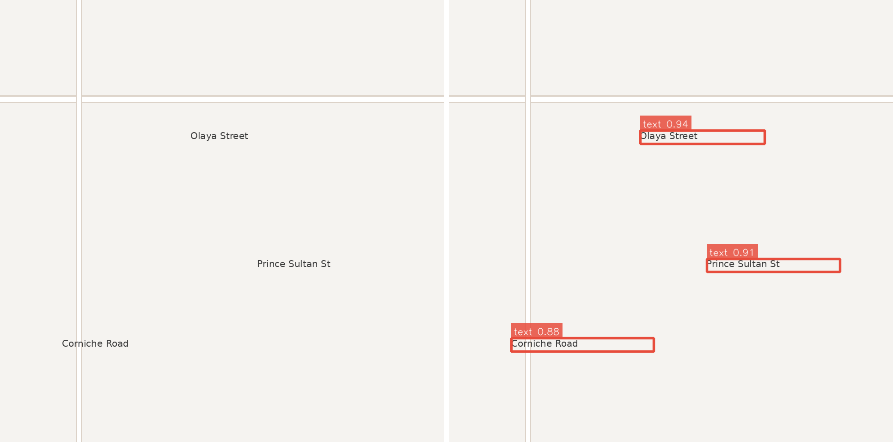

# Bilingual Map Text Detection

Detecting and localising Arabic and English text labels on rendered map tiles.



*Renderer illustration — Left: input map tile. Right: resolution-scaled bounding boxes with contrasting label chips.*

---

## The Problem

Rendered raster map tiles embed critical navigational information directly into image pixels — including street names, district labels, and points of interest. Because text is baked into the raster layer, querying street names requires detecting and localizing the text regions first.

Scene text detection models trained on natural photography often transfer poorly to cartographic tiles due to distinct challenges:

- **Small and thin label geometry:** Many street and district names span only 12–16 pixels in height on a 960-pixel tile. Standard downsampling degrades thin character strokes.
- **Orientation along roadways:** Labels align with underlying road geometry, running horizontally, diagonally, or along curves.
- **Bilingual scripts:** Arabic is cursive, right-to-left, and connected, while English is discrete and left-to-right. Both scripts frequently appear within the same tile or road corridor.
- **Complex background features:** Road casing lines, contours, and hatching visually resemble thin character strokes.

---

## Dataset

| Attribute | Full Dataset | Bundled Sample (`data/sample`) |
|---|---|---|
| **Tiles** | ~1,200 tiles | 20 synthetic check tiles |
| **Annotations** | YOLO format (`class xc yc w h`, normalised) | YOLO format (`class xc yc w h`, normalised) |
| **Classes** | 1 (`text`) | 1 (`text`) |
| **Scripts** | Arabic, English, and bilingual mixed labels | Synthetic Latin road names (English only) |
| **Source / Provenance** | Rendered tiles from OpenStreetMap (ODbL, Carto style) | Synthetic check tiles for smoke testing |
| **Split Strategy** | Geographic split: Riyadh (Train/Val), Jeddah (Test) | Verification check set |

A 20-tile synthetic test sample is provided in [`data/sample`](data/sample) so the repository is runnable immediately on clone.

> **Splitting Note:** Splits in the full dataset are partitioned by geographic region rather than random assignment. Tiles from the same urban area share font typography, layout styling, and street naming vocabulary; random splitting would risk data leakage between splits.

---

## Approach

The system employs single-class YOLOv8 object detection (`yolov8s`) to localize text regions. Every text occurrence is treated as a unified `text` instance, decoupling text localization from downstream OCR script recognition.

Key design decisions:

- **Training at `imgsz=960`:** Guided by dataset auditing ([`docs/audit.md`](docs/audit.md)), higher input resolution keeps the share of sub-12px boxes to ~2.9%, preserving character edge details.
- **Rotation augmentation disabled (`degrees=0.0`):** Label angle directly mirrors road orientation; arbitrary rotation injects annotation noise.
- **Horizontal flipping disabled (`fliplr=0.0`):** Mirrored Arabic script is orthographically invalid.
- **Single-class formulation:** Separates the spatial problem of finding text from the linguistic problem of reading it.

---

## Results

Evaluated on the held-out **Jeddah** test split at `imgsz=960`. Detailed metrics output: [`docs/metrics.md`](docs/metrics.md).

| Metric | Value |
|---|---|
| **mAP@50** | 0.9412 |
| **mAP@50-95** | 0.6640 |
| **Precision** | 0.8925 |
| **Recall** | 0.9444 |

### Qualitative Observations & Failure Modes
- **Script Handling:** Visual inspection of model predictions indicates consistent bounding box localization across both Arabic and Latin text instances.
- **Dense Intersections:** In complex intersections with densely packed overlapping labels, Non-Maximum Suppression (NMS) can occasionally merge closely adjacent boxes.
- **Low-Contrast Regions:** Detection sensitivity decreases slightly over textured green areas and shaded topography fills.

---

## Quickstart

### 1. Clone & Environment Setup

```bash
git clone https://github.com/rakansul/Bilingual-Map-Text-Detection.git
cd Bilingual-Map-Text-Detection
python -m venv .venv && source .venv/bin/activate   # Windows: .venv\Scripts\activate
pip install -r requirements.txt
```

### 2. Run Inference on Sample Tiles

```bash
# Download weights from GitHub Releases (or use local checkpoint)
python -m src.predict \
    --weights best.pt \
    --source data/sample/images \
    --out assets/predictions \
    --compare --save-json
```

### 3. Full Training & Evaluation Pipeline

```bash
# 1. Audit dataset annotations
python -m src.audit_dataset --images datasets/map_text/images/train --labels datasets/map_text/labels/train --imgsz 960

# 2. Train YOLOv8s detector
python -m src.train --data configs/data.yaml --model yolov8s.pt --epochs 120 --imgsz 960

# 3. Evaluate on held-out test split
python -m src.evaluate --weights runs/detect/map_text/weights/best.pt --split test --imgsz 960
```

Complete execution instructions: [`docs/RUNBOOK.md`](docs/RUNBOOK.md).

---

## Repository Layout

```
├── configs/
│   ├── data.yaml            # Full dataset configuration
│   └── data.sample.yaml     # Bundled sample configuration
├── src/
│   ├── __init__.py
│   ├── audit_dataset.py     # Annotation and box size auditor
│   ├── draw.py              # Resolution-scaled rendering with Arabic shaping
│   ├── evaluate.py          # Validation and metrics generator
│   ├── make_sample.py       # Generates stratified sample to replace synthetic check set
│   ├── predict.py           # Inference with visual & JSON export
│   └── train.py             # YOLOv8 training entry point
├── data/sample/             # 20 synthetic pipeline-check images and labels
├── assets/                  # Figures and prediction outputs
├── docs/                    # Runbook, dataset audit, and metrics
├── scripts/                 # Verification shell scripts
├── requirements.txt
├── LICENSE
└── README.md
```

---

## Visualisation Pipeline

Standard OpenCV `cv2.putText` functions use absolute pixel font sizes and lack right-to-left Arabic glyph shaping.

[`src/draw.py`](src/draw.py) implements dynamic rendering:
- **Resolution-Scaled Sizing:** Font scale, line thickness, and padding scale proportionally with image dimensions, constrained by minimum and maximum bounds for legibility.
- **Contrasting Background Chips:** Renders semi-transparent background chips behind text for legibility over dense map backgrounds.
- **Multilingual Support Groundwork:** Includes integrated Pillow text rendering with `arabic-reshaper` and `python-bidi` for contextual right-to-left Arabic shaping, ready for multi-class and OCR transcription heads.

---

## Limitations

- **Axis-Aligned Bounding on Diagonal Roads:** Street names following angled roads are fitted with standard axis-aligned boxes, incorporating some background map context (see aspect ratio analysis in [`docs/audit.md`](docs/audit.md)).
- **Single-Class Output:** Identifies text presence and location without per-script labels.
- **Detection Only:** Focuses on spatial localization rather than text transcription/OCR.

---

## Future Work

- **Oriented Bounding Boxes (YOLOv8-OBB):** Transitioning to rotated 4-point polygon annotations to fit diagonal and curved street names tightly.
- **Script Classification Head:** Multi-head classification (`text_ar`, `text_en`, `text_mixed`) to route detections to specialized downstream OCR models.
- **End-to-End OCR Pipeline:** Integrating text recognition for complete map transcription.
- **FastAPI Inference Microservice:** Lightweight REST API for automated tile inference.

---

## License & Provenance

- **Code:** MIT License — see [LICENSE](LICENSE).
- **Map Data:** OpenStreetMap data © [OpenStreetMap contributors](https://www.openstreetmap.org/copyright), licensed under the [Open Database License (ODbL)](https://opendatacommons.org/licenses/odbl/). Map styling based on OpenStreetMap Carto (CC-BY-SA 2.0).

---

## Author

**Rakan Al-Wahaibi**  
Computer Engineering, King Saud University
